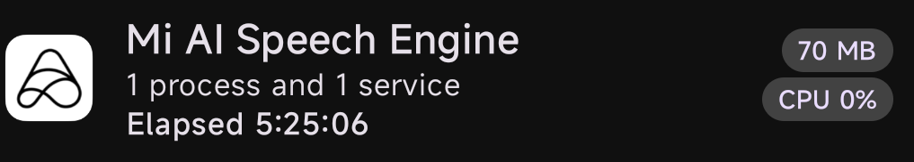
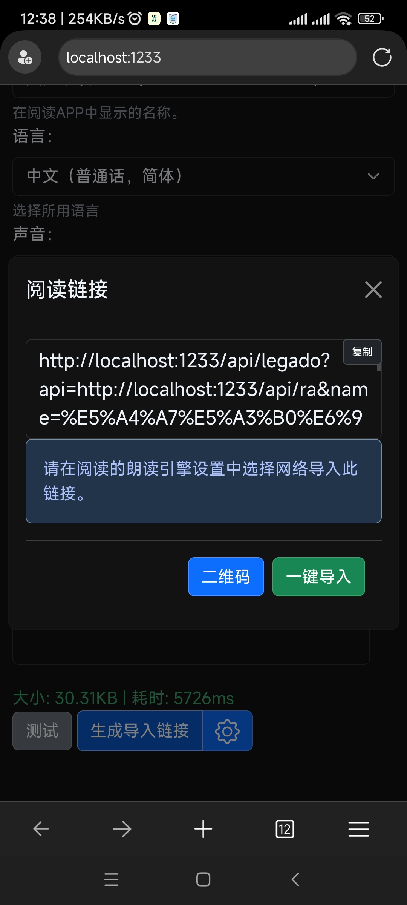

tts引擎安装上就运行了，

还是要禁用？

小米tts引擎，
com.xiaomi.mibrain.speech
1.5.1

还有一个tts server android，是edge浏览器的大声朗读在线引擎包装，效果真好，能给legado阅读使用，就是感觉不完善，在系统中显示无法正常使用

注意设置时要用浏览器打开，右上角流量器按钮。

讯飞一个tts引擎，没有找到独立安卓安装包。。。

更新：2024-03-17 20:49 字数：410/644
