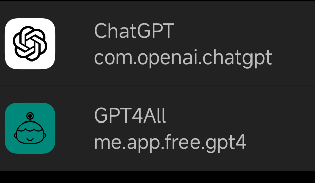

chatgpt 3.5版本免费了，有几个使用方法总结一下，
1. 注册登录官方网页版，需要魔法
    https://openai.com

2. 官方也有安卓APP下载了，在apkmirror上有，包名com.openai.chatgpt，还有图标，注意不要下载错了。
    使用需要魔法，需要最新google play服务，不然会报错，看图一的报错信息

3. 使用第三方的安卓APP，名字叫gpt4all，包名叫 me.app.free.gpt4。不需要魔法，不需要账号和登陆。

现在我能够正常使用的是1和3，而且3是最方便的。

这个也可以吗，听说还有claude3，
https://chandler.bet/#/overView
不过听v2ex说claude3封号严重，还是不试他了

。。。

更新：2024-03-08 12:20 字数：547/895
